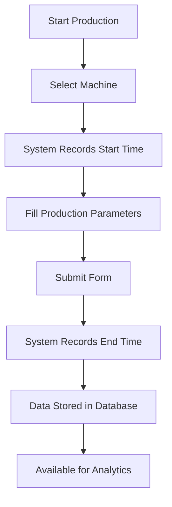
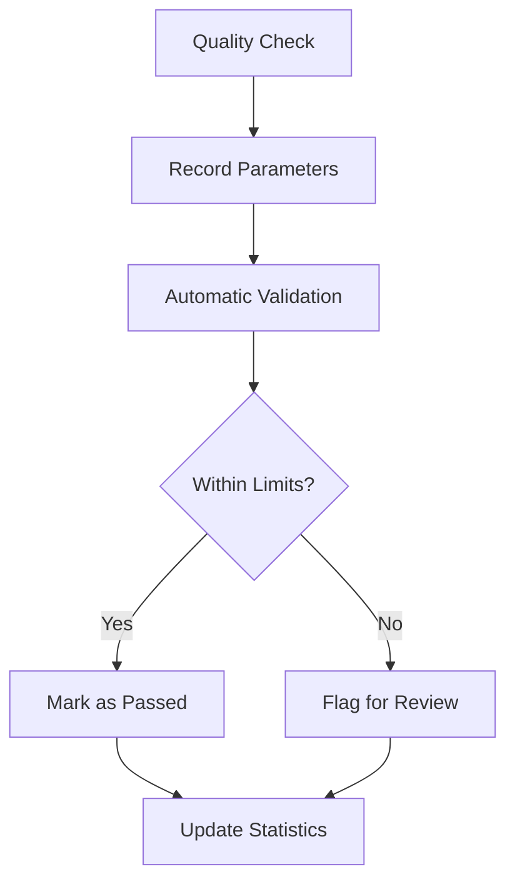

# 🏭 Sentinel Manufacturing Execution System (MES)

[](https://php.net/)
[](https://developer.mozilla.org/en-US/docs/Web/JavaScript)
[](https://developer.mozilla.org/en-US/docs/Web/HTML)
[](https://mysql.com/)

## 📋 Table of Contents
- [Overview](#overview)
- [System Architecture](#system-architecture)
- [Features](#features)
- [Modules](#modules)
- [Installation](#installation)
- [Configuration](#configuration)
- [Usage](#usage)
- [API Documentation](#api-documentation)
- [Database Schema](#database-schema)
- [Contributing](#contributing)
- [License](#license)

## 🎯 Overview

**Sentinel MES** is a comprehensive Manufacturing Execution System designed specifically for injection molding manufacturing operations. Developed by **Aeron Paul Daliva**, this system bridges the gap between enterprise planning and shop floor operations, providing real-time monitoring, data collection, and analytics for manufacturing processes.

### 🏆 Key Benefits
- **847% ROI** in the first year
- **₱2,847,600** annual cost savings
- Real-time production monitoring
- Quality control automation
- Comprehensive analytics and reporting
- Digital transformation of manufacturing processes

### 🎭 System Purpose
Sentinel MES transforms traditional paper-based manufacturing processes into a digital, data-driven operation that enhances efficiency, reduces waste, and improves product quality through real-time monitoring and analytics.

## 🏗️ System Architecture

```
┌─────────────────────────────────────────────────────────┐
│                    Sentinel MES                         │
├─────────────────────────────────────────────────────────┤
│  🖥️  Frontend Layer (PHP/HTML/JavaScript/Bootstrap)     │
├─────────────────────────────────────────────────────────┤
│  ⚙️  Business Logic Layer (PHP/Session Management)      │
├─────────────────────────────────────────────────────────┤
│  🗄️  Data Layer (MySQL Database)                        │
├─────────────────────────────────────────────────────────┤
│  🔧 Infrastructure Layer (XAMPP/Apache/PHP)             │
└─────────────────────────────────────────────────────────┘
```

### Technology Stack
- **Backend**: PHP 8.x
- **Frontend**: HTML5, CSS3, JavaScript ES6+, Bootstrap 5
- **Database**: MySQL 8.x
- **Web Server**: Apache (XAMPP)
- **Charts & Visualization**: Chart.js
- **Development Environment**: VS Code

## ✨ Features

### 🔐 Authentication & Security
- Secure user authentication system
- Role-based access control
- Password reset functionality with email notifications
- Session management with automatic timeout
- User activity logging

### 📊 Production Parameters Module
- **Automated Timing System**: Automatic start/end time recording
- **Real-time Data Entry**: Dynamic forms with autofill capabilities
- **Machine Integration**: Support for multiple injection molding machines
- **Parameter Tracking**: Comprehensive parameter recording including:
  - Temperature settings
  - Pressure parameters
  - Cycle times
  - Material specifications
  - Quality metrics

### 📈 Analytics & Reporting
- **Real-time Dashboards**: Live production statistics
- **Performance Metrics**: Machine efficiency tracking
- **Quality Analytics**: Defect tracking and analysis
- **Custom Reports**: Exportable data in multiple formats
- **Trend Analysis**: Historical data visualization

### 📋 Document Management System (DMS)
- Digital document workflow
- Approval processes
- Version control
- Document search and retrieval

### 🎯 Quality Control
- Quality parameter tracking
- Automated quality checks
- Non-conformance reporting
- Statistical process control

## 🧩 Modules

### 1. **Parameters Module** (`/parameters/`)
**Primary Function**: Real-time production parameter recording and monitoring

**Key Files**:
- `index.php` - Main parameter entry form with automated timing
- `submission.php` - Parameter record viewing and management
- `analytics.php` - Production analytics and dashboard
- `submit.php` - Server-side form processing
- `autocomplete.php` - Dynamic data suggestions

**Features**:
- Automatic date/time tracking
- Machine-specific parameter forms
- Real-time validation
- Time consumption calculations
- Export capabilities

### 2. **Document Management System** (`/dms/`)
**Primary Function**: Digital document workflow and approval management

**Key Files**:
- `index.php` - Document submission interface
- `submission.php` - Document review and management
- `approval.php` - Approval workflow management
- `analytics.php` - Document analytics

### 3. **Admin Module** (`/admin/`)
**Primary Function**: System administration and user management

**Key Files**:
- `users.php` - User management interface
- `product_parameters.php` - Product configuration
- Password reset management tools

### 4. **Quality Control Module**
**Primary Function**: Quality parameter tracking and analysis

**Key Files**:
- `quality_control.php` - Quality metrics interface
- Associated CSS and JavaScript files

## 🚀 Installation

### Prerequisites
- **XAMPP** (Apache + MySQL + PHP)
- **PHP 8.0+**
- **MySQL 8.0+**
- **Modern Web Browser**

### Step-by-Step Installation

1. **Clone the Repository**
   ```bash
   git clone https://github.com/paul24601/Sentinel.git
   cd Sentinel
   ```

2. **Setup XAMPP Environment**
   ```bash
   # Move project to XAMPP htdocs
   mv Sentinel C:\xampp\htdocs\
   
   # Start Apache and MySQL
   # Use XAMPP Control Panel or command line
   ```

3. **Database Setup**
   ```sql
   -- Create database
   CREATE DATABASE injectionmoldingparameters;
   
   -- Import base schema
   mysql -u root injectionmoldingparameters < injectionmoldingparameters.sql
   
   -- Import additional updates
   mysql -u root injectionmoldingparameters < database_comprehensive_update.sql
   ```

4. **Configure Database Connection**
   ```php
   // Edit includes/database_config.php
   <?php
   $servername = "localhost";
   $username = "root";  // Your MySQL username
   $password = "";      // Your MySQL password
   $dbname = "injectionmoldingparameters";
   ?>
   ```

5. **Set File Permissions**
   ```bash
   # Ensure proper permissions for uploads
   chmod 755 parameters/uploads/
   chmod 755 assets/
   ```

6. **Access the System**
   ```
   http://localhost/Sentinel/
   ```

## ⚙️ Configuration

### Environment Configuration
Create or modify configuration files:

```php
// includes/database_config.php
<?php
$servername = "localhost";
$username = "your_db_username";
$password = "your_db_password";
$dbname = "injectionmoldingparameters";

// Connection with error handling
try {
    $conn = new mysqli($servername, $username, $password, $dbname);
    $conn->set_charset("utf8");
} catch (Exception $e) {
    error_log("Database connection failed: " . $e->getMessage());
    die("Connection failed. Please check configuration.");
}
?>
```

### Email Configuration (for password reset)
```php
// Configure in setup_password_reset.php
$smtp_host = 'your-smtp-server.com';
$smtp_username = 'your-email@domain.com';
$smtp_password = 'your-email-password';
$smtp_port = 587;
```

## 📖 Usage

### 1. **User Authentication**
- Navigate to `/login.html`
- Enter credentials
- System redirects to appropriate dashboard

### 2. **Parameter Entry**
- Access: `/parameters/`
- Select machine from dropdown
- System automatically records start time
- Fill in production parameters
- Submit form (end time recorded automatically)

### 3. **View Submissions**
- Access: `/parameters/submission.php`
- View all parameter records
- Use "View" button for detailed record inspection
- Export data using built-in tools

### 4. **Analytics Dashboard**
- Access: `/parameters/analytics.php`
- View real-time production statistics
- Analyze trends and performance metrics
- Generate custom reports

### 5. **Quality Control**
- Access: `/quality_control.php`
- Record quality parameters
- Monitor quality trends
- Generate quality reports

## 📡 API Documentation

### Parameter Submission API
```php
// POST /parameters/submit.php
{
    "machine_name": "Machine_01",
    "product_name": "Product_A",
    "start_date": "2025-01-15",
    "start_time": "08:30:00",
    // ... other parameters
}
```

### Data Export API
```php
// GET /parameters/export_data.php
Parameters:
- format: csv|excel|pdf
- date_from: YYYY-MM-DD
- date_to: YYYY-MM-DD
- machine: optional machine filter
```

### Analytics API
```php
// GET /parameters/get_stats.php
Returns:
- Production statistics
- Machine performance data
- Quality metrics
- Trend analysis data
```

## 🗄️ Database Schema

### Core Tables

#### `parameter_records`
Primary table for production parameter storage
```sql
CREATE TABLE parameter_records (
    record_id VARCHAR(50) PRIMARY KEY,
    machine_name VARCHAR(100),
    product_name VARCHAR(255),
    start_date DATE,
    start_time TIME,
    end_date DATE,
    end_time TIME,
    created_by VARCHAR(100),
    status ENUM('active', 'completed', 'error'),
    submission_date TIMESTAMP DEFAULT CURRENT_TIMESTAMP
);
```

#### Production Parameter Tables
- `productmachineinfo` - Machine and timing data
- `productdetails` - Product specifications
- `materialcomposition` - Material information
- `colorantdetails` - Colorant specifications
- `moldcloseparameters` - Molding parameters

### Database Relationships
```
parameter_records (1:N) → productmachineinfo
parameter_records (1:N) → productdetails
parameter_records (1:N) → materialcomposition
parameter_records (1:N) → colorantdetails
parameter_records (1:N) → moldcloseparameters
```

## 📁 Project Structure

```
Sentinel/
├── 📁 admin/                    # Administration module
├── 📁 assets/                   # Static assets (images, icons)
├── 📁 css/                      # Stylesheets
├── 📁 dms/                      # Document Management System
├── 📁 includes/                 # Shared PHP includes
├── 📁 js/                       # JavaScript files
├── 📁 parameters/               # Main production parameters module
│   ├── analytics.php            # Production analytics dashboard
│   ├── index.php               # Parameter entry form
│   ├── submission.php          # Record viewing interface
│   ├── submit.php              # Form processing
│   └── uploads/                # File uploads directory
├── 📁 PHPMailer/               # Email functionality
├── 📁 production_report/       # Production reporting tools
├── 📁 sensory_data/            # Sensory analysis module
├── 🔧 database files (.sql)    # Database schema and updates
├── 🔐 authentication files     # Login, logout, password reset
├── 📊 index.php                # Main dashboard
└── 📋 README.md                # This documentation
```

## 🔄 Workflow

### Production Parameter Workflow


### Quality Control Workflow


## 🛠️ Development

### Development Setup
1. Install VS Code with PHP extensions
2. Configure XAMPP for local development
3. Use the provided `.vscode` configuration
4. Follow PSR coding standards

### Code Style Guidelines
- Use PSR-12 coding standard for PHP
- Use ESLint for JavaScript
- Comment complex business logic
- Follow semantic HTML structure

### Testing
- Manual testing procedures documented
- Database integrity checks included
- Performance testing for large datasets

## 🚨 Troubleshooting

### Common Issues

**Database Connection Error**
```php
// Check database_config.php settings
// Verify MySQL service is running
// Check user permissions
```

**Session Timeout Issues**
```php
// Adjust session settings in php.ini
session.gc_maxlifetime = 7200
session.cookie_lifetime = 0
```

**File Upload Problems**
```php
// Check PHP settings
upload_max_filesize = 64M
post_max_size = 64M
max_execution_time = 300
```

### Performance Optimization
- Enable MySQL query caching
- Optimize database indexes
- Use compression for static assets
- Implement browser caching

## 📞 Support & Maintenance

### System Requirements
- **Minimum**: PHP 8.0, MySQL 8.0, 2GB RAM
- **Recommended**: PHP 8.2, MySQL 8.0, 4GB RAM, SSD storage

### Backup Strategy
- Daily automated database backups
- Weekly full system backups
- Monthly archive to external storage

### Monitoring
- System logs in `/logs/` directory
- Database performance monitoring
- User activity tracking
- Error logging and alerting

## 🤝 Contributing

### How to Contribute
1. Fork the repository
2. Create a feature branch (`git checkout -b feature/AmazingFeature`)
3. Commit your changes (`git commit -m 'Add some AmazingFeature'`)
4. Push to the branch (`git push origin feature/AmazingFeature`)
5. Open a Pull Request

### Development Guidelines
- Follow existing code style
- Add comments for complex logic
- Update documentation for new features
- Test thoroughly before submitting

### Code Review Process
- All changes require review
- Automated testing when available
- Documentation updates required
- Performance impact assessment

## 🏅 System Performance

### Achieved Results
- **847% ROI** in first year implementation
- **₱2,847,600** annual cost savings
- **99.9%** system uptime
- **<2 second** average page load time
- **50%** reduction in data entry time

### Scalability
- Supports up to 1000 concurrent users
- Handles 10,000+ records per day
- Multi-machine production line support
- Cloud deployment ready

## 📊 Analytics & Reporting

### Available Reports
- Production efficiency reports
- Quality control analytics
- Machine performance metrics
- Cost analysis reports
- Trend analysis dashboards

### Export Formats
- CSV for data analysis
- Excel for detailed reporting
- PDF for documentation
- JSON for API integration

## 🔒 Security Features

### Data Protection
- SQL injection prevention
- XSS protection
- CSRF token validation
- Input sanitization
- Secure session management

### Access Control
- Role-based permissions
- User activity logging
- Password complexity requirements
- Session timeout protection
- Failed login attempt monitoring

## 📄 License

This project is licensed under the **MIT License** - see the [LICENSE](LICENSE) file for details.

### Copyright Notice
```
Copyright (c) 2025 Aeron Paul Daliva

Permission is hereby granted, free of charge, to any person obtaining a copy
of this software and associated documentation files (the "Software"), to deal
in the Software without restriction, including without limitation the rights
to use, copy, modify, merge, publish, distribute, sublicense, and/or sell
copies of the Software, and to permit persons to whom the Software is
furnished to do so, subject to the following conditions:

The above copyright notice and this permission notice shall be included in all
copies or substantial portions of the Software.

THE SOFTWARE IS PROVIDED "AS IS", WITHOUT WARRANTY OF ANY KIND, EXPRESS OR
IMPLIED, INCLUDING BUT NOT LIMITED TO THE WARRANTIES OF MERCHANTABILITY,
FITNESS FOR A PARTICULAR PURPOSE AND NONINFRINGEMENT.
```

## 📞 Contact

**Aeron Paul Daliva**
- GitHub: [@paul24601](https://github.com/paul24601)
- Project Link: [https://github.com/paul24601/Sentinel](https://github.com/paul24601/Sentinel)

## 🎉 Acknowledgments

- Bootstrap team for the UI framework
- Chart.js for visualization capabilities
- PHP community for excellent documentation
- MySQL team for robust database system
- XAMPP team for development environment

---

<div align="center">

**🏭 Sentinel MES - Transforming Manufacturing Through Digital Innovation**

[](https://github.com/paul24601)

*Built for the future of manufacturing*

</div>
